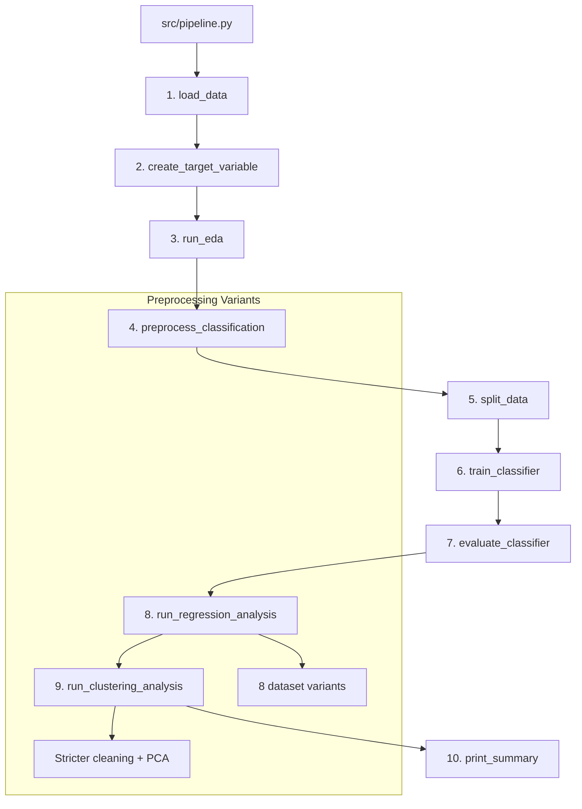
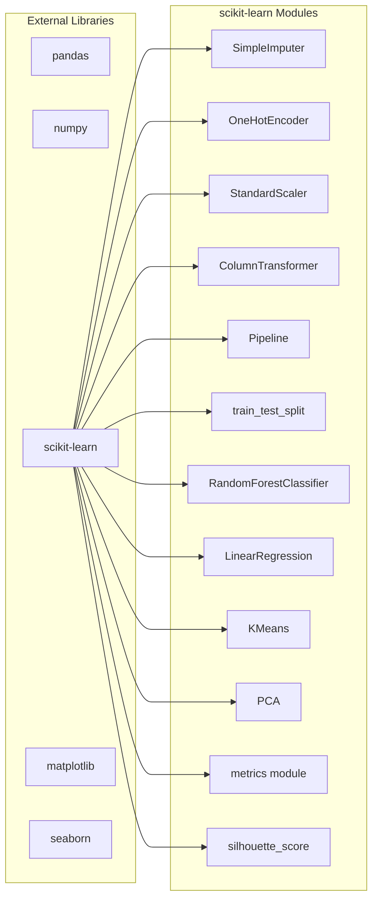

# Design Document — HeartLink Heart Disease Prediction Pipeline

## Overview

HeartLink is a single-script, reproducible machine learning pipeline (`src/pipeline.py`) that ingests the UCI Heart Disease dataset and delivers three complementary analyses: binary classification of heart disease presence, regression to predict maximum heart rate as a proxy for cardiac functional decline, and unsupervised clustering to discover patient risk groups. The pipeline is designed for NHS clinical contexts and prioritises data integrity, clinical guardrails, and full reproducibility over model complexity.

The architecture follows a sequential, function-based design within a single Python module. Each logical stage — data loading, target creation, EDA, preprocessing, splitting, training, and evaluation — is encapsulated in a dedicated function. Three distinct preprocessing pipelines serve the three modelling tasks, reflecting their differing data quality requirements. All outputs (plots, metrics, reports) are persisted to an `outputs/` directory, and a global random seed of 42 ensures deterministic results across runs.

### Key Design Decisions

1. **Single-script architecture**: A monolithic `src/pipeline.py` keeps the prototype simple and auditable. Each stage is a pure-ish function that receives a DataFrame and returns a transformed DataFrame or model artefact, making the flow easy to trace.

2. **Three separate preprocessing pipelines**: Classification uses a standard ColumnTransformer (median/mode imputation, one-hot encoding, standardisation). Regression tests 8 dataset variants across hospital inclusion, imputation method, and outlier removal. Clustering applies stricter cleaning — excluding high-missingness columns, removing sparse rows, and using sex-and-age-group median imputation for cholesterol — before PCA dimensionality reduction.

3. **Clinical guardrails over algorithmic sophistication**: Zero values in `trestbps` and `chol` are replaced with NaN before any imputation, preventing biologically impossible readings from corrupting model training.

4. **Deterministic reproducibility**: `random_state=42` is set globally (NumPy, Python's `random` module) and passed explicitly to every scikit-learn estimator and `train_test_split` call.

## Architecture

The pipeline executes as a linear sequence of stages. There is no web server, API, or database — it is a batch-processing script.



### Execution Flow

1. **`load_data(path)`** — Reads CSV, validates 16 columns, prints shape and head.
2. **`create_target_variable(df)`** — Binarises `num` → `Target_Variable`, drops `num`.
3. **`run_eda(df)`** — Generates summary stats, missing-value counts, and saves all EDA plots to `outputs/`.
4. **`preprocess_classification(df)`** — Drops `id`/`dataset`, applies clinical guardrails, builds a `ColumnTransformer` with median imputation + standardisation for numericals and mode imputation + one-hot encoding for categoricals.
5. **`split_data(X, y)`** — 80/20 stratified split, seed 42.
6. **`train_classifier(X_train, y_train)`** — Fits `RandomForestClassifier(random_state=42)`.
7. **`evaluate_classifier(model, X_test, y_test)`** — Computes accuracy, precision, recall, F1, AUC-ROC; saves confusion matrix, ROC curve, and classification report.
8. **`run_regression_analysis(df)`** — Generates 8 dataset variants, trains `LinearRegression` on each, selects best by R², saves comparison table and plots.
9. **`run_clustering_analysis(df)`** — Applies stricter preprocessing, PCA, KMeans with silhouette-based k selection (2–8), saves elbow plot and cluster scatter.
10. **`main()`** — Orchestrates all stages, ensures `outputs/` exists, sets global seed, prints final summary.


## Components and Interfaces

All components reside in `src/pipeline.py`. Each function has a clear signature and responsibility.

### Function Signatures

```python
def load_data(filepath: str) -> pd.DataFrame:
    """Load CSV, validate 16 columns, print shape and head. Raises FileNotFoundError."""

def create_target_variable(df: pd.DataFrame) -> tuple[pd.DataFrame, pd.Series]:
    """Binarise num → Target_Variable, drop num. Returns (features_df, target_series)."""

def run_eda(df: pd.DataFrame, target: pd.Series, output_dir: str) -> None:
    """Print summary stats and missing counts. Save heatmap, distribution, boxplot, and
    target distribution PNGs to output_dir."""

def apply_clinical_guardrails(df: pd.DataFrame) -> pd.DataFrame:
    """Replace biologically impossible zero values in trestbps and chol with NaN.
    Print count of replacements per column. Returns cleaned DataFrame."""

def build_classification_preprocessor() -> ColumnTransformer:
    """Construct a ColumnTransformer with:
    - Numerical pipeline: SimpleImputer(strategy='median') → StandardScaler
    - Categorical pipeline: SimpleImputer(strategy='most_frequent') → OneHotEncoder(drop='first')
    Returns the unfitted ColumnTransformer."""

def preprocess_classification(df: pd.DataFrame) -> tuple[np.ndarray, list[str]]:
    """Drop id/dataset, apply guardrails, fit-transform via ColumnTransformer.
    Returns (transformed_array, feature_names)."""

def split_data(
    X: np.ndarray, y: pd.Series, test_size: float = 0.2, random_state: int = 42
) -> tuple[np.ndarray, np.ndarray, pd.Series, pd.Series]:
    """Stratified train-test split. Returns (X_train, X_test, y_train, y_test)."""

def train_classifier(
    X_train: np.ndarray, y_train: pd.Series, random_state: int = 42
) -> RandomForestClassifier:
    """Fit RandomForestClassifier on training data. Returns fitted model."""

def evaluate_classifier(
    model: RandomForestClassifier,
    X_test: np.ndarray,
    y_test: pd.Series,
    output_dir: str,
) -> dict[str, float]:
    """Compute accuracy, precision, recall, F1, AUC-ROC. Save confusion matrix,
    ROC curve, classification report. Returns metrics dict."""

def generate_regression_variants(df: pd.DataFrame) -> list[dict]:
    """Generate 8 dataset variants by combining hospital inclusion, imputation method,
    and outlier removal. Each dict contains: label, X, y, description."""

def train_and_evaluate_regression(
    variants: list[dict], output_dir: str
) -> pd.DataFrame:
    """For each variant: split 80/20 (seed 42), train LinearRegression, compute MAE/RMSE/R².
    Select best by R². Save comparison CSV, scatter plot, residual plot.
    Returns comparison DataFrame."""

def preprocess_clustering(df: pd.DataFrame) -> tuple[np.ndarray, int]:
    """Exclude ca/thal/slope, remove rows with >30% missing, impute chol by sex-age-group
    median, impute remaining numericals by median and categoricals by mode, one-hot encode,
    standardise, apply PCA(n_components=0.9). Returns (pca_array, n_components)."""

def run_clustering_analysis(df: pd.DataFrame, output_dir: str) -> None:
    """Preprocess, evaluate KMeans for k=2..8 via silhouette score, train with optimal k,
    save elbow plot and cluster scatter, print cluster summary."""

def main() -> None:
    """Entry point. Set global seed, ensure outputs/ exists, orchestrate all stages,
    print final summary of generated files."""
```

### Dependency Map




## Data Models

### Input Schema — `data/heart_disease_uci.csv`

| Column     | Type        | Description                                      | Valid Range / Values                                         |
|------------|-------------|--------------------------------------------------|--------------------------------------------------------------|
| `id`       | int         | Unique patient identifier                        | 1–920                                                        |
| `age`      | int/float   | Patient age in years                             | Positive integer; clinically 0–120                            |
| `sex`      | str         | Biological sex                                   | `Male`, `Female`                                             |
| `dataset`  | str         | Source hospital                                  | `Cleveland`, `Hungary`, `Switzerland`, `VA Long Beach`       |
| `cp`       | str         | Chest pain type                                  | `typical angina`, `atypical angina`, `non-anginal`, `asymptomatic` |
| `trestbps` | int/float   | Resting blood pressure (mmHg)                    | Clinically 60–250; 0 = biologically impossible               |
| `chol`     | int/float   | Serum cholesterol (mg/dl)                        | Clinically 100–600; 0 = biologically impossible              |
| `fbs`      | str/bool    | Fasting blood sugar > 120 mg/dl                  | `TRUE`, `FALSE`                                              |
| `restecg`  | str         | Resting ECG results                              | `normal`, `st-t abnormality`, `lv hypertrophy`               |
| `thalch`   | int/float   | Maximum heart rate achieved                      | Clinically 60–220                                            |
| `exang`    | str/bool    | Exercise-induced angina                          | `TRUE`, `FALSE`                                              |
| `oldpeak`  | float       | ST depression induced by exercise                | ≥ 0.0                                                        |
| `slope`    | str         | Slope of peak exercise ST segment                | `upsloping`, `flat`, `downsloping`                           |
| `ca`       | int/float   | Number of major vessels coloured by fluoroscopy  | 0–3 (high missingness in non-Cleveland sources)              |
| `thal`     | str         | Thalassaemia type                                | `normal`, `fixed defect`, `reversable defect`                |
| `num`      | int         | Heart disease severity                           | 0–4 (0 = absent)                                             |

### Derived Data Structures

#### Target Variable

```python
# Binarisation mapping
Target_Variable: pd.Series  # dtype int, values in {0, 1}
# 0 → no heart disease (num == 0)
# 1 → heart disease present (num ∈ {1, 2, 3, 4})
```

#### Classification Feature Sets

```python
NUMERICAL_FEATURES: list[str] = ["age", "trestbps", "chol", "thalch", "oldpeak", "ca"]
CATEGORICAL_FEATURES: list[str] = ["sex", "cp", "fbs", "restecg", "exang", "slope", "thal"]
DROP_COLUMNS: list[str] = ["id", "dataset"]
```

#### Regression Feature Sets

```python
REGRESSION_FEATURES: list[str] = ["age", "trestbps", "chol"]
REGRESSION_TARGET: str = "thalch"
```

#### Regression Dataset Variant Structure

```python
@dataclass
class DatasetVariant:
    label: str               # e.g. "All-Unknown-WithOutliers"
    hospital: str            # "all" | "cleveland"
    imputation: str          # "unknown" | "mean_mode"
    outlier_removal: bool    # True | False
    X: np.ndarray            # Feature matrix after variant preprocessing
    y: np.ndarray            # Target array (thalch)
    sample_count: int        # Number of rows after preprocessing
    feature_count: int       # Number of features
```

The 8 variants are the Cartesian product of:
- **Hospital inclusion**: `["all", "cleveland"]`
- **Imputation method**: `["unknown", "mean_mode"]`
- **Outlier removal**: `[False, True]`

#### Regression Comparison Table

```python
# Output: outputs/regression_variant_comparison.csv
columns = ["variant_label", "hospital", "imputation", "outlier_removal",
           "n_samples", "MAE", "RMSE", "R2"]
```

#### Clustering Preprocessing Parameters

```python
CLUSTERING_EXCLUDE_COLUMNS: list[str] = ["ca", "thal", "slope"]
MISSING_THRESHOLD: float = 0.30          # Remove rows with >30% missing
PCA_VARIANCE_THRESHOLD: float = 0.90     # Retain ≥90% variance
K_RANGE: range = range(2, 9)             # Evaluate k from 2 to 8
```

#### Output File Manifest

| File                                        | Stage          | Format |
|---------------------------------------------|----------------|--------|
| `outputs/correlation_heatmap.png`           | EDA            | PNG    |
| `outputs/target_distribution.png`           | EDA            | PNG    |
| `outputs/distribution_*.png`                | EDA            | PNG    |
| `outputs/boxplot_*.png`                     | EDA            | PNG    |
| `outputs/confusion_matrix.png`              | Classification | PNG    |
| `outputs/roc_curve.png`                     | Classification | PNG    |
| `outputs/classification_report.txt`         | Classification | TXT    |
| `outputs/regression_variant_comparison.csv` | Regression     | CSV    |
| `outputs/regression_scatter.png`            | Regression     | PNG    |
| `outputs/regression_residuals.png`          | Regression     | PNG    |
| `outputs/clustering_elbow.png`              | Clustering     | PNG    |
| `outputs/clustering_scatter.png`            | Clustering     | PNG    |


## Correctness Properties

*A property is a characteristic or behaviour that should hold true across all valid executions of a system — essentially, a formal statement about what the system should do. Properties serve as the bridge between human-readable specifications and machine-verifiable correctness guarantees.*

### Property 1: Binarisation correctness and completeness

*For any* DataFrame with a `num` column containing values in {0, 1, 2, 3, 4}, applying `create_target_variable` SHALL produce a `Target_Variable` series where every value is in {0, 1}, where original 0 maps to 0 and original values 1–4 map to 1, and the returned features DataFrame SHALL NOT contain the `num` column.

**Validates: Requirements 2.1, 2.3, 2.4**

### Property 2: Clinical guardrails replace biologically impossible values

*For any* DataFrame containing `trestbps` and `chol` columns with zero values, applying `apply_clinical_guardrails` SHALL replace every zero in those columns with NaN, whilst leaving all non-zero values unchanged.

**Validates: Requirements 4.2, 8.2**

### Property 3: Imputation completeness

*For any* DataFrame with NaN values in numerical columns (age, trestbps, chol, thalch, oldpeak) and categorical columns (sex, cp, fbs, restecg, exang, slope, thal), after applying the imputation step of the preprocessing pipeline, no NaN values SHALL remain in any of those columns.

**Validates: Requirements 4.4, 4.5, 9.4**

### Property 4: One-hot encoding produces correct column count

*For any* set of categorical columns, applying one-hot encoding with `drop='first'` SHALL produce a number of output columns equal to the sum of (unique non-null categories − 1) for each input categorical column.

**Validates: Requirements 4.6, 9.5**

### Property 5: Standardisation produces zero mean and unit variance

*For any* numerical column with at least two distinct values, after applying `StandardScaler`, the transformed column SHALL have a mean within 1e-7 of 0 and a standard deviation within 1e-7 of 1.

**Validates: Requirements 4.7, 9.5**

### Property 6: Train-test split preserves data and respects proportions

*For any* dataset of size n ≥ 5, splitting with `test_size=0.2` SHALL produce a training set and testing set whose sizes sum to n, with the testing set size equal to `round(n * 0.2)` (within ±1 due to rounding and stratification).

**Validates: Requirements 5.1, 8.5**

### Property 7: Stratified split preserves class proportions

*For any* binary target variable, after a stratified 80/20 split, the proportion of class 1 in the training set and the proportion of class 1 in the testing set SHALL each be within 0.05 of the proportion of class 1 in the original dataset.

**Validates: Requirements 5.3**

### Property 8: Non-predictive and high-missingness columns are excluded

*For any* DataFrame containing `id`, `dataset`, `ca`, `thal`, and `slope` columns: (a) after classification preprocessing, `id` and `dataset` SHALL be absent; (b) after clustering preprocessing, `id`, `dataset`, `ca`, `thal`, and `slope` SHALL all be absent.

**Validates: Requirements 4.1, 9.1**

### Property 9: Clustering row filter removes high-missingness rows

*For any* DataFrame, after applying the >30% missingness row filter, no remaining row SHALL have more than 30% of its values missing.

**Validates: Requirements 9.2**

### Property 10: Cholesterol sex-and-age-group median imputation

*For any* DataFrame with missing `chol` values, after applying sex-and-age-group median imputation, no NaN values SHALL remain in the `chol` column, and each imputed value SHALL equal the median `chol` of the corresponding sex-and-age-group.

**Validates: Requirements 9.3**

### Property 11: PCA retains at least 90% of variance

*For any* standardised feature matrix with more than one feature, applying `PCA(n_components=0.9)` SHALL produce a transformed matrix whose cumulative explained variance ratio is ≥ 0.90.

**Validates: Requirements 9.6**

### Property 12: Best regression variant has maximum R²

*For any* set of 8 evaluated regression variants with computed R² scores, the selected best variant SHALL have an R² score greater than or equal to every other variant's R² score.

**Validates: Requirements 8.9**

### Property 13: Optimal k has maximum silhouette score

*For any* set of silhouette scores computed for k = 2 through 8, the selected optimal k SHALL correspond to the highest silhouette score among all evaluated k values.

**Validates: Requirements 9.9**

### Property 14: Pipeline idempotence

*For any* valid input CSV and fixed random seed of 42, executing the pipeline twice SHALL produce identical classification metrics (accuracy, precision, recall, F1, AUC-ROC), identical regression metrics (MAE, RMSE, R² per variant), and identical clustering results (silhouette score, cluster assignments).

**Validates: Requirements 5.2, 6.2, 10.5**


## Error Handling

### Data Loading Errors

| Error Condition                          | Handling Strategy                                                                 |
|------------------------------------------|-----------------------------------------------------------------------------------|
| CSV file not found                       | Raise `FileNotFoundError` with a message including the expected path              |
| CSV has unexpected columns               | Raise `ValueError` listing expected vs actual column names                        |
| CSV is empty (0 rows)                    | Raise `ValueError` indicating the dataset contains no patient records             |

### Data Quality Errors

| Error Condition                                  | Handling Strategy                                                        |
|--------------------------------------------------|--------------------------------------------------------------------------|
| `num` column contains values outside {0,1,2,3,4} | Log a warning and clip values to the valid range before binarisation     |
| All values in a numerical column are NaN          | Log a warning; imputation will produce NaN (median of empty series)      |
| A categorical column has no mode (all NaN)        | Log a warning; the column will remain NaN after mode imputation          |

### Preprocessing Errors

| Error Condition                                        | Handling Strategy                                                     |
|--------------------------------------------------------|-----------------------------------------------------------------------|
| ColumnTransformer encounters unseen categories at test | `OneHotEncoder(handle_unknown='ignore')` silently drops unknown cats  |
| Standardisation of a constant column (std = 0)         | `StandardScaler` produces 0 for constant columns; no error raised     |
| PCA receives fewer samples than components              | scikit-learn raises `ValueError`; let it propagate with context       |

### Model Training Errors

| Error Condition                                  | Handling Strategy                                                      |
|--------------------------------------------------|------------------------------------------------------------------------|
| Training set is empty after preprocessing        | Raise `ValueError` indicating insufficient data for training           |
| Regression variant has no valid rows after NaN drop | Skip the variant, log a warning, and continue with remaining variants |

### Output Errors

| Error Condition                          | Handling Strategy                                                        |
|------------------------------------------|--------------------------------------------------------------------------|
| `outputs/` directory cannot be created   | Let `os.makedirs` raise `OSError`; do not silently swallow               |
| Plot saving fails (e.g., disk full)      | Let `matplotlib.savefig` raise `OSError`; do not silently swallow        |

### General Principles

- **Fail fast on structural errors**: Missing files, wrong schemas, and empty datasets should halt the pipeline immediately with clear error messages.
- **Warn and continue on data quality issues**: Biologically impossible values, high missingness, and skipped regression variants are logged but do not halt execution.
- **Let library exceptions propagate**: scikit-learn and pandas exceptions are not caught unless the pipeline can add meaningful context.
- **All print statements use descriptive prefixes**: e.g., `[GUARDRAIL]`, `[EDA]`, `[CLASSIFICATION]`, `[REGRESSION]`, `[CLUSTERING]` for easy log parsing.

## Testing Strategy

### Testing Framework

- **Unit and example tests**: `pytest`
- **Property-based tests**: `hypothesis` (Python's leading PBT library)
- **Test location**: `tests/` directory at project root

### Dual Testing Approach

#### Unit Tests (Example-Based)

Unit tests cover specific scenarios, edge cases, integration points, and file-output verification:

- **Data loading**: Verify CSV loads with correct shape; verify `FileNotFoundError` on missing file; verify column validation rejects wrong schemas.
- **EDA outputs**: Verify all expected PNG files are created in `outputs/`.
- **Classification evaluation**: Verify confusion matrix, ROC curve, and classification report files are created; verify metrics are printed.
- **Regression**: Verify exactly 8 variants are generated; verify comparison CSV has 8 rows; verify scatter and residual plots are saved.
- **Clustering**: Verify elbow and scatter plots are saved; verify cluster summary is printed.
- **End-to-end smoke test**: Run `python src/pipeline.py` and verify exit code 0 and all output files exist.

#### Property-Based Tests (Hypothesis)

Each correctness property from the design document is implemented as a single Hypothesis test with a minimum of 100 iterations. Tests are tagged with the property they validate.

| Property | Test Description | Key Generators |
|----------|-----------------|----------------|
| 1 | Binarisation correctness | `st.integers(min_value=0, max_value=4)` for `num` values |
| 2 | Clinical guardrails | `st.floats` including 0.0 for trestbps/chol columns |
| 3 | Imputation completeness | DataFrames with random NaN placement via `st.none()` |
| 4 | One-hot encoding column count | Random categorical columns with varying cardinality |
| 5 | Standardisation mean/std | Random float arrays with `st.floats` |
| 6 | Split proportions | Random arrays of varying sizes (5–1000) |
| 7 | Stratified split class proportions | Binary targets with varying class ratios |
| 8 | Column exclusion | DataFrames with id/dataset/ca/thal/slope columns |
| 9 | Row missingness filter | DataFrames with random NaN patterns |
| 10 | Cholesterol sex-age-group imputation | DataFrames with known sex/age groups and missing chol |
| 11 | PCA variance retention | Random standardised matrices |
| 12 | Best variant by R² | Lists of 8 random R² values |
| 13 | Optimal k by silhouette | Lists of 7 random silhouette scores (k=2..8) |
| 14 | Pipeline idempotence | Full pipeline run twice on same input |

### Test Configuration

```python
# hypothesis settings for all property tests
from hypothesis import settings

@settings(max_examples=100)
```

### Tag Format

Each property test includes a docstring tag:

```python
"""Feature: heart-disease-prediction, Property 1: Binarisation correctness and completeness"""
```

### Test Execution

```bash
# Run all tests
pytest tests/ -v

# Run only property-based tests
pytest tests/ -v -k "property"

# Run only unit tests
pytest tests/ -v -k "not property"
```
