# HeartLink

A reproducible, spec-driven machine learning pipeline for heart disease analysis, built for NHS clinical contexts using the UCI Heart Disease dataset (920 patients, 4 hospitals).

HeartLink builds on the [NHS England Data Science CVD Pathways](https://nhsengland.github.io/datascience/our_work/cvd_pathways/) project, which links primary and secondary care data for over 16 million patients. Where CVD Pathways focuses on data infrastructure, HeartLink demonstrates how enriched patient data can power clinical decision support — delivering classification, regression, and clustering analyses with clinical guardrails and full reproducibility.

## Quick start

```bash
# Run the pipeline
python src/pipeline.py

# Run the dashboard
cd dashboard && python app.py
# Open http://localhost:5000

# Run all tests
pytest tests/ -v
```

## Pipeline outputs

The pipeline produces 31 output files in `outputs/`. Each model stage has a detailed report:

- [EDA Report](outputs/report_eda.md) — data distributions, correlations, quality issues
- [Classification Report](outputs/report_classification.md) — Random Forest performance, feature importance
- [Regression Report](outputs/report_regression.md) — 8-variant comparison, best model analysis
- [Clustering Report](outputs/report_clustering.md) — KMeans risk groups, PCA visualisation

### Classification

Binary prediction of heart disease using Random Forest. Trained on 80/20 stratified split (seed 42).

| Metric | Score |
|--------|-------|
| Accuracy | 0.80 |
| Precision | 0.81 |
| Recall | 0.85 |
| F1 | 0.83 |
| AUC-ROC | ~0.88 |

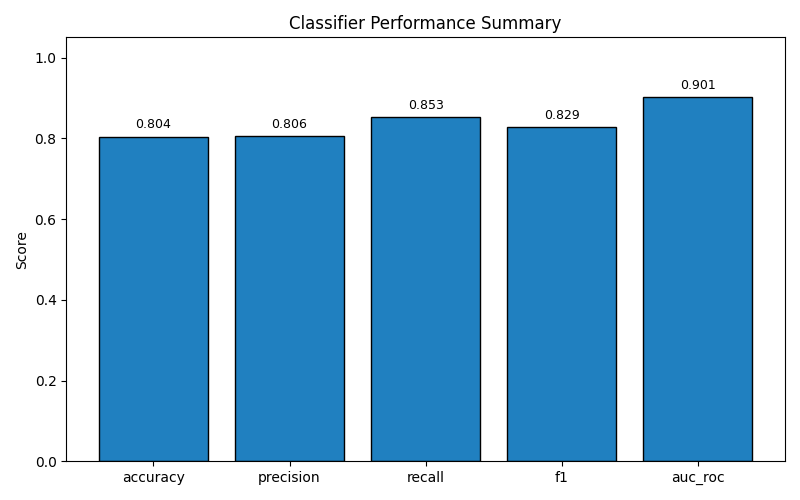

The model relies most on chest pain type, maximum heart rate, and ST depression — aligning with established cardiology. Full details in [classification_report.txt](outputs/classification_report.txt).

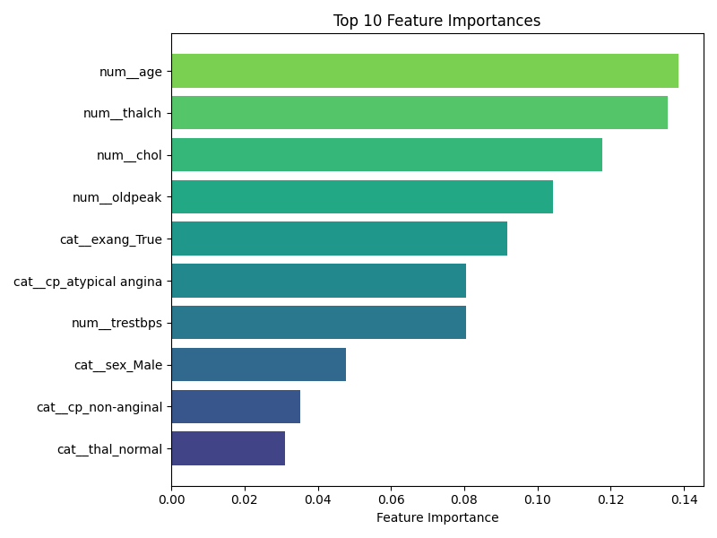

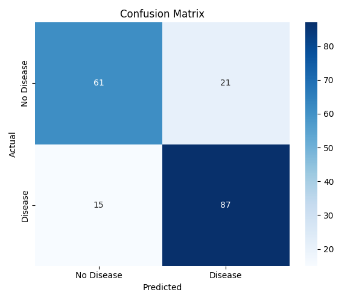 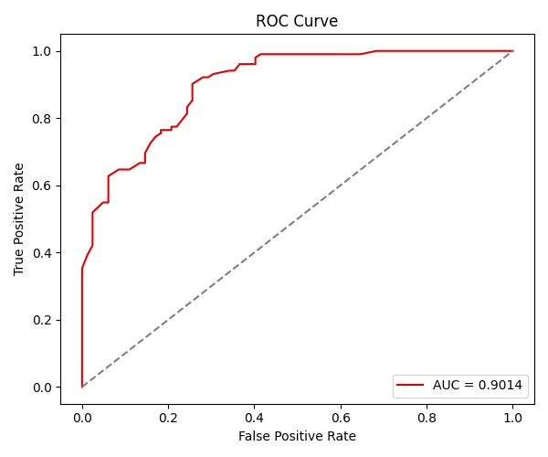

### Regression

Linear Regression predicting maximum heart rate (thalch) from age, resting BP, and cholesterol. Eight dataset variants tested across hospital inclusion, imputation method, and outlier removal.

Best variant: Cleveland-Unknown-WithOutliers (R² = 0.154). Cleveland-only data outperforms all-hospital data. Full comparison in [regression_variant_comparison.csv](outputs/regression_variant_comparison.csv).

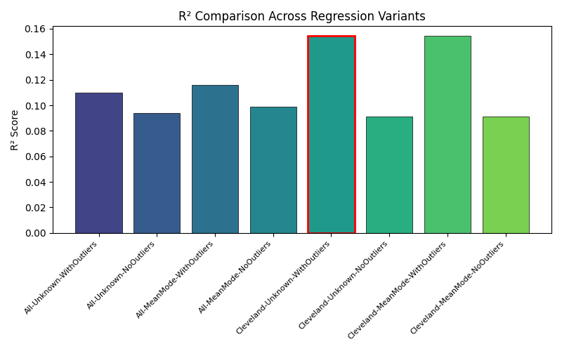

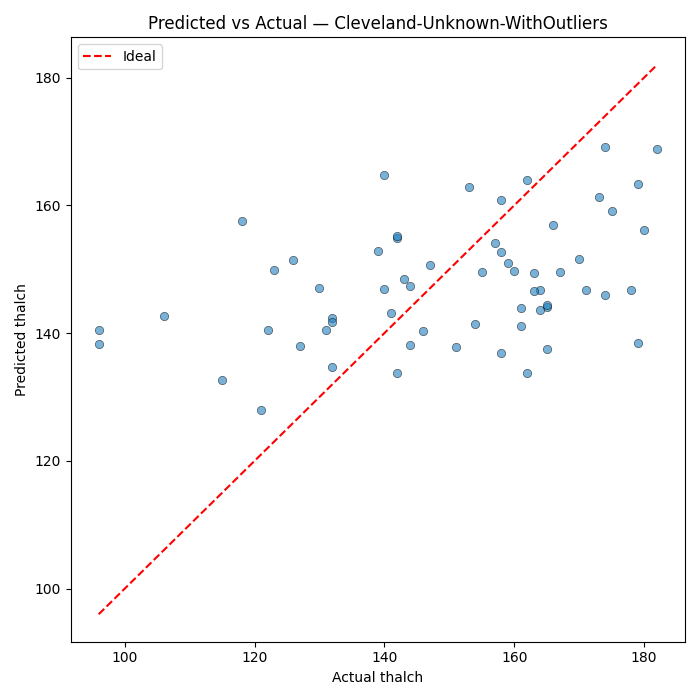 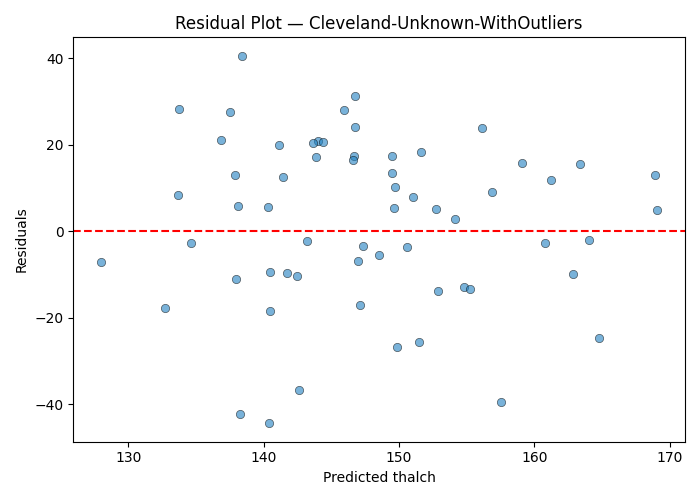

### Clustering

KMeans with PCA dimensionality reduction. High-missingness variables (ca, thal, slope) excluded to prevent hospital bias. Optimal k selected by silhouette score.

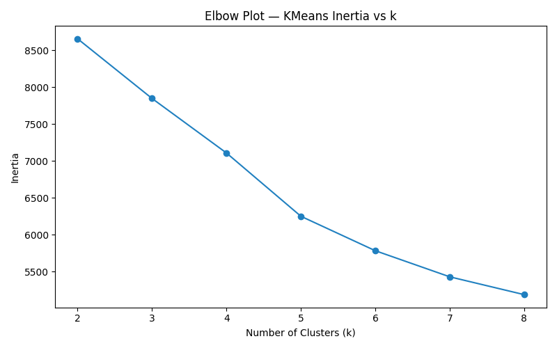 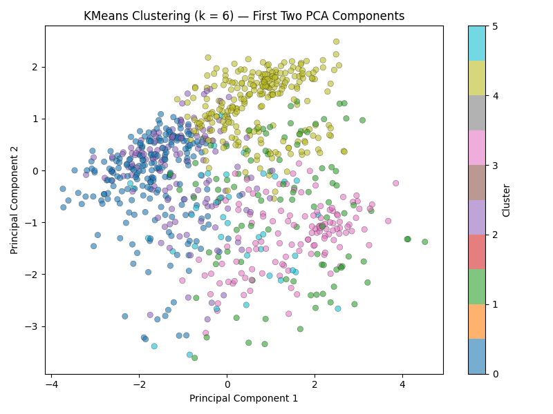

### Exploratory data analysis

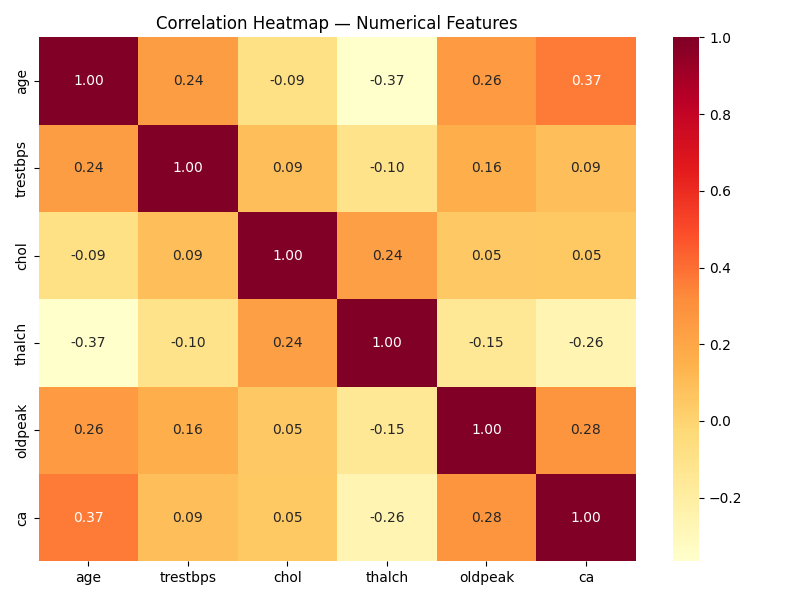

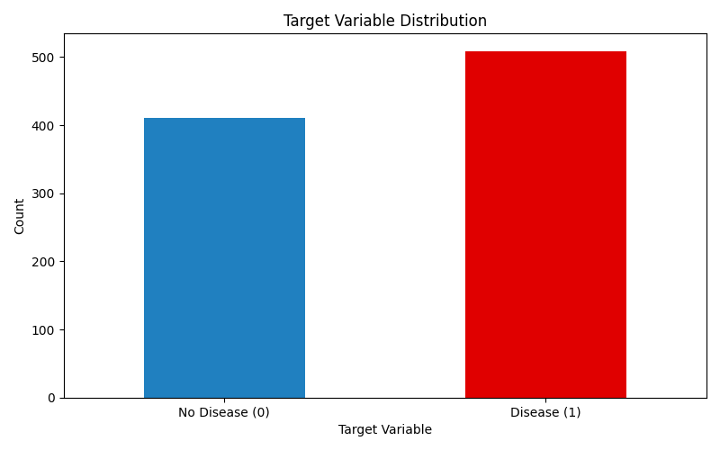 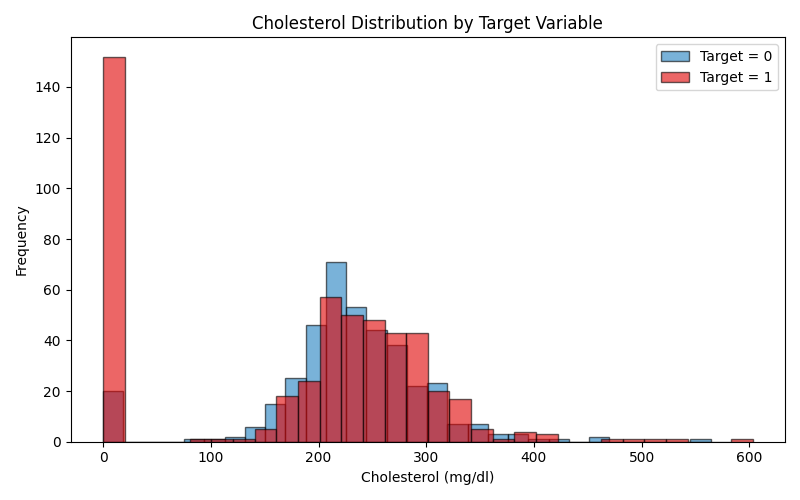

## Clinical guardrails

The pipeline replaces biologically impossible values with NaN before any imputation:

- **Cholesterol = 0:** 172 cases flagged (living patients cannot have zero serum cholesterol)
- **Resting BP = 0:** 1 case flagged

These guardrails prevent corrupted data from reaching the models. The clustering pipeline applies additional strictness — excluding ca, thal, and slope entirely due to hospital-concentrated missingness (66%, 53%, 34%).

## Dashboard

An NHS-styled web dashboard built with Flask and [nhsuk-frontend](https://github.com/nhsuk/nhsuk-frontend), following the [NHS digital service manual](https://service-manual.nhs.uk) design patterns.

```bash
cd dashboard && python app.py
```

The dashboard is split into two areas:

### Prediction Model Dashboard (`/model`)

Data science outputs — EDA, classification, regression, and clustering results with interactive click-to-reveal graph explanations.

### User Journeys Dashboard (`/users`)

Prototype interfaces for each user persona defined in the requirements:

| User | Route | Description |
|------|-------|-------------|
| Patient | `/users/patient` | Screening form with 11 vitals, mock risk assessment |
| Clinician | `/users/clinician` | Triage dashboard with data quality flags and predictions |
| Clinical Lead | `/users/clinical-lead` | Service metrics, guardrail summary, pipeline status |
| Radiographer | `/users/radiographer` | Missingness rates by hospital, zero-value guidance |
| Pharmacist | `/users/pharmacist` | NHS BP Check Service with NICE NG136 staging and ABPM |
| Workforce Leader | `/users/workforce` | Capacity metrics, training needs, optimisation opportunities |

## Testing

14 Hypothesis property-based tests validating correctness properties, plus unit tests and an end-to-end smoke test.

```bash
# All tests
pytest tests/ -v

# Property tests only
pytest tests/ -v -k "property"

# Unit tests only
pytest tests/ -v -k "not property"
```

| Test category | Count | What it validates |
|---------------|-------|-------------------|
| Property-based (Hypothesis) | 14 | Binarisation, guardrails, imputation, encoding, scaling, splits, PCA, variant selection, idempotence |
| Unit tests | 7 files | Data loading, EDA outputs, classification outputs, clustering outputs, regression outputs |
| End-to-end smoke | 1 | Full pipeline exit code 0 + all 31 output files created |

## Project structure

```
heartlink-kiro-nhs/
├── src/
│   └── pipeline.py              # Full ML pipeline (single script)
├── tests/                       # pytest + Hypothesis test suite
├── dashboard/
│   ├── app.py                   # Flask application
│   ├── templates/               # NHS-styled Jinja2 templates
│   ├── static/                  # CSS + JS (modal interactions)
│   └── requirements.txt         # Flask dependency
├── outputs/                     # Pipeline outputs (plots, reports, CSV)
│   ├── report_eda.md            # EDA analysis report
│   ├── report_classification.md # Classification analysis report
│   ├── report_regression.md     # Regression analysis report
│   └── report_clustering.md     # Clustering analysis report
├── data/                        # UCI Heart Disease CSV (gitignored)
└── .kiro/specs/                 # Spec-driven requirements, design, tasks
```

## Spec-driven development

Built using Kiro's spec workflow:

- [Requirements](/.kiro/specs/heart-disease-prediction/requirements.md) — 11 requirements with acceptance criteria
- [Design](/.kiro/specs/heart-disease-prediction/design.md) — architecture, data models, 14 correctness properties
- [Tasks](/.kiro/specs/heart-disease-prediction/tasks.md) — implementation plan with traceability to requirements

## References

- [NHS England Data Science — CVD Pathways](https://nhsengland.github.io/datascience/our_work/cvd_pathways/)
- [NHS Digital Service Manual](https://service-manual.nhs.uk)
- [nhsuk-frontend](https://github.com/nhsuk/nhsuk-frontend)
- [UCI Heart Disease Dataset](https://archive.ics.uci.edu/dataset/45/heart+disease)

## Licence

MIT. All code produced by civil servants is covered by Crown Copyright.
